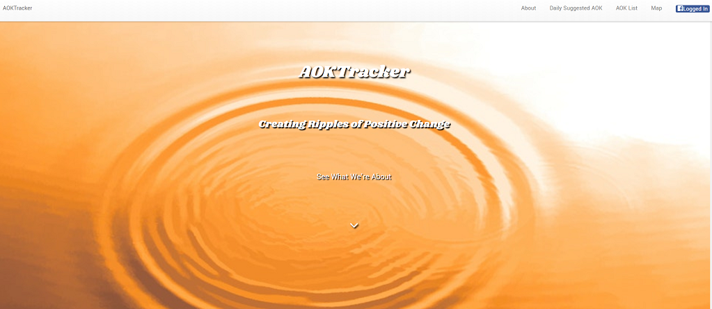
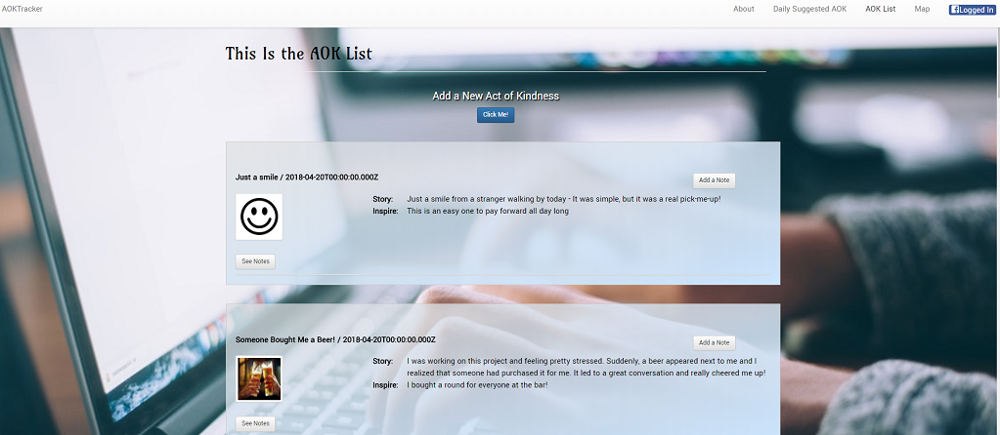
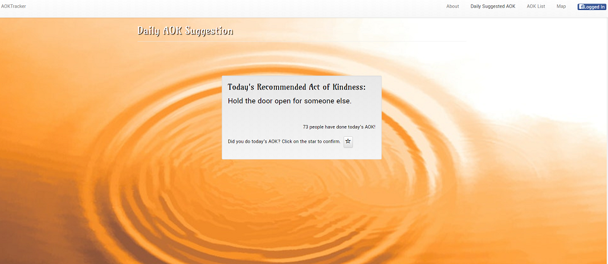
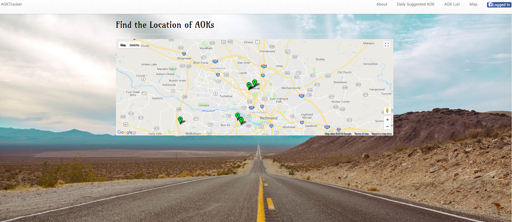

# AOKTracker

### Overview

Share acts of kindness and encourage others to pay-it-forward!  The purpose of this app is to log acts of kindness and visualize how far the impact of each ripples out. We've used MongoDB, React, Google Maps, Facebook Login, and other technologies to create this app. We are following the MVC design pattern; using Node and Mongoose to query and route the data in the app, and React to build the frontend.

-----------------------------------------
#### April 2018 

-----------------------------------------

Current Version 1.0

---

* Log Acts of Kindness that you have experienced and share them with other people.

* Comment on someone else's AOK.  Definitely reach out, if you inspired it!

* Check out the map page to see where AOKs have occurred.

* Join others who are doing the AOK of the Day!

* Spread a little kindness!

* [Check out this web site to see it in action!](https://aoktracker.herokuapp.com/.

---

## Screenshots

<table>
    <tr>
        <td>
            
        </td>
    </tr>
    <tr>
        <td>
            
        </td>
    </tr>
    <tr>
        <td>
            
        </td>
    </tr>
    <tr>
        <td>
            
        </td>
    </tr>
</table>

## How you can help

* Please let us know if you find any errors or if you have ways to achieve better efficiency.

-----------------------------------------

### How does the app work?

1. The app uses MongoDB to store the data.

2. The data is routed to the frontend by way of Mongoose and API requests, using Axios.

3. The data is rendered to the user by the React JS library.

4. The app is hosted on Heroku and the data is stored using mLab.

## Server Dependencies
    
    "body-parser": "^1.18.2",
    "dotenv": "^5.0.1",
    "express": "^4.15.4",
    "gtoken": "^2.3.0",
    "mongoose": "^5.0.12",
    "query-string": "^6.0.0",
    "react-google-maps": "^9.4.5"

## Client Dependencies

    "axios": "^0.18.0",
    "react": "^16.0.0",
    "react-bootstrap": "^0.32.1",
    "react-dom": "^16.0.0",
    "react-facebook-login": "^4.0.1",
    "react-google-maps": "^9.4.5",
    "react-router-dom": "^4.2.2",
    "react-scripts": "1.0.14",
    "react-scroll": "^1.7.8"

## History

This project was created as a group project on 04-21-18 for the University of Richmond Coding Bootcamp.

## License

This project is in the public domain within the United States, and
copyright and related rights in the work worldwide are waived through
the [CC0 1.0 Universal public domain dedication](https://creativecommons.org/publicdomain/zero/1.0/).# aoktracker
